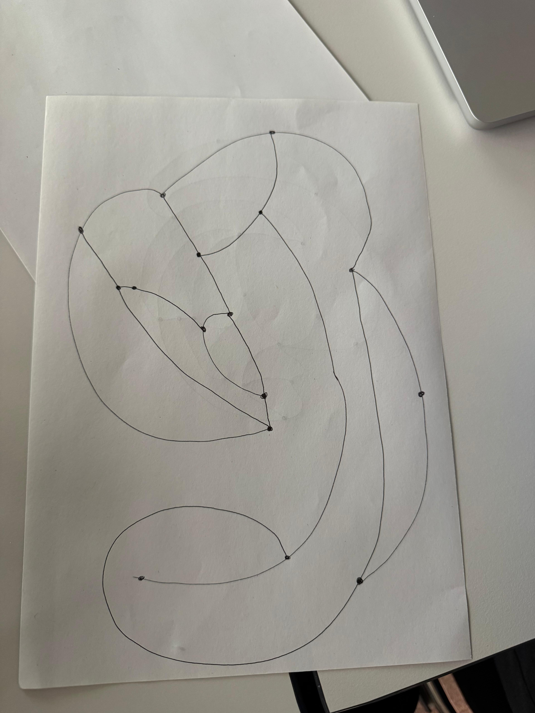

# Week 01
Analog compared to coding rules is easy as the input goes directly from the mind to the hand and therefore on paper. Coding rules are more complicated as transforming art into coding is more complicated.

In the exercise done in pairs i found interesting how everything can basically be art. 

 
I found a lot of inspiration in early computer artists and systems thinkers — people like Vera Molnár, who used rules and chance to explore geometric abstraction, or the patterns found in Islamic art and nature, where structure and imperfection coexist harmoniously.

Setting up the environment wasn't difficult, as i worked with similar environment in the past but haven't use it in a while. The most difficult part was to actually use p5.js as the I had to reasearch the references to sketch my idea.
