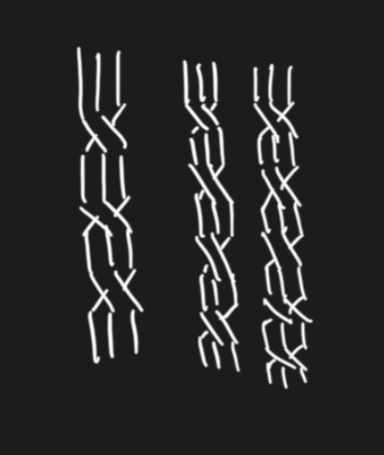
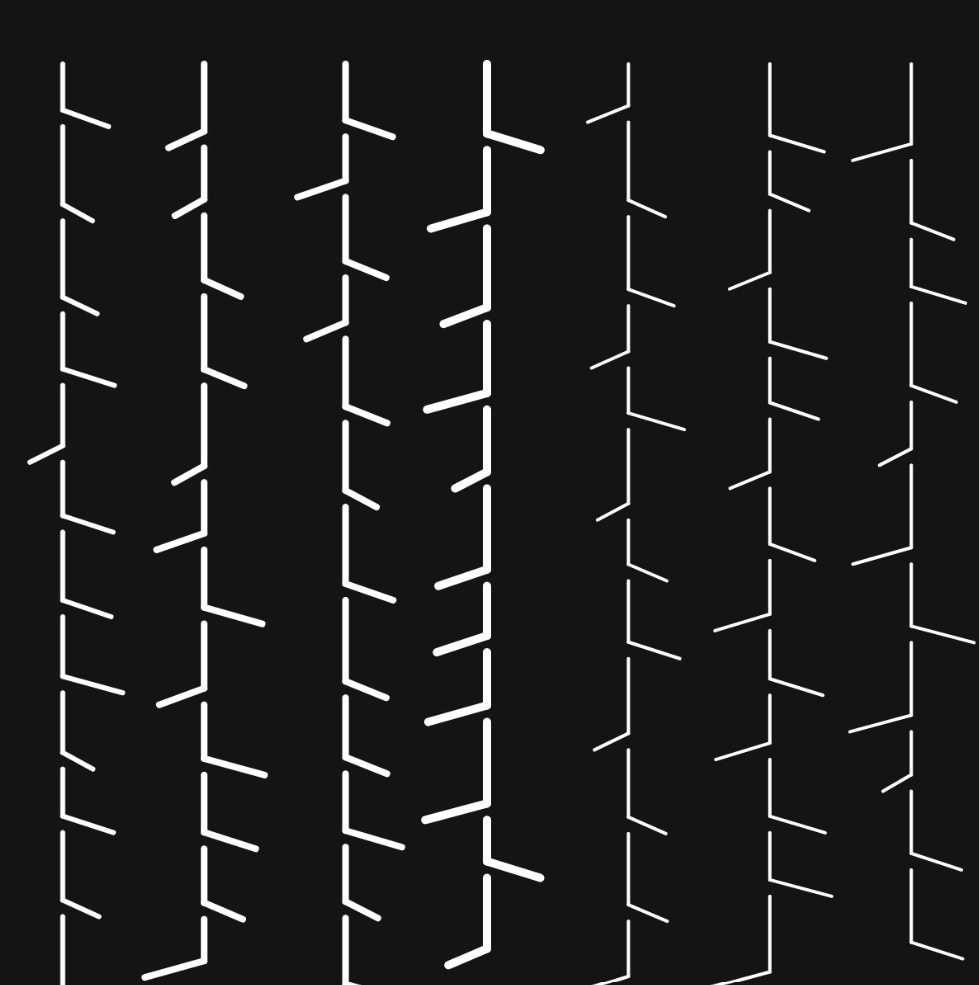

# Week 03

When I read the "pattern" a thing I did in my childhood came up in my mind. A very easy and relaxing pattern to draw when bored or anxious.

With the help of AI i tried to create a good base to modify by myself:

>Write p5.js code to reproduce following pattern. Make sure the pattern has 7 defined columns and random line size like in the sketch

Looking at this pattern it reminded me of bamboos trees for some reason.
I then took over and program the pattern by myself with the base I had. My goal was to fill the canva with columns to have an order and randomize the segment length. As the AI randomized the segment width and I liked it, i decided to randomize that too. 

Working with code felt limited compared to the hands-on freedom of analog creation, which makes me really admire artists who master those systems, but on the other side i like the thrill of seeing complex, unexpected results just by trying out new combinations of random and simple lines.

The final product was programmed by me with a bit of AI. 

<iframe src="content\W03\pattern.html" width="100%" height="450" ></iframe>
